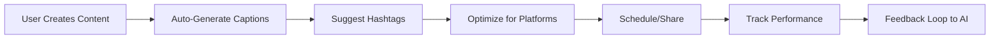

# FoodieSnap Platform Integration Strategy

**Comprehensive Strategy for Platform Integration and Workflow Automation**

---

## Table of Contents

1. [Integration Philosophy](#integration-philosophy)
2. [Health & Fitness Platform Integrations](#health--fitness-platform-integrations)
3. [Social Media Integration](#social-media-integration)
4. [Development Tool Integrations](#development-tool-integrations)
5. [Workflow Automation](#workflow-automation)
6. [API Strategy](#api-strategy)
7. [Implementation Roadmap](#implementation-roadmap)

---

## Integration Philosophy

### Core Principles

#### 1. **User-Centric Integration**
- **Seamless Experience**: Integrations should feel native, not like external add-ons
- **Data Ownership**: Users maintain control over their data and sharing preferences
- **Value Addition**: Every integration must provide clear value to the user journey
- **Progressive Enhancement**: Core app functionality remains intact without integrations

#### 2. **Privacy-First Approach**
- **Minimal Data Sharing**: Only share necessary data for specific features
- **Explicit Consent**: Clear opt-in for each integration with detailed permissions
- **Revocable Access**: Users can disconnect integrations at any time
- **Audit Trail**: Clear visibility into what data is shared and when

#### 3. **Platform Agnostic Design**
- **Standardized Interfaces**: Common integration patterns across platforms
- **Fallback Strategies**: Graceful degradation when integrations are unavailable
- **Vendor Independence**: Avoid lock-in to specific platforms or services
- **Future-Proof Architecture**: Extensible framework for new integrations

---

## Health & Fitness Platform Integrations

### Primary Integrations (Phase 1)

#### 1. **MyFitnessPal Integration**
**Value Proposition**: Automatic nutrition logging from FoodieSnap meals

**Integration Architecture:**
```typescript
interface MyFitnessPalIntegration {
  // Authentication
  oauth: {
    provider: 'myfitnesspal',
    scopes: ['nutrition.write', 'diary.read'],
    redirectUri: 'foodiesnap://oauth/myfitnesspal'
  },
  
  // Data Sync
  sync: {
    direction: 'bidirectional',
    frequency: 'real-time',
    dataTypes: ['nutrition_facts', 'meal_timing', 'food_items']
  },
  
  // Features
  features: [
    'auto_log_scanned_nutrition',
    'import_nutrition_goals',
    'sync_meal_timing',
    'cross_platform_streaks'
  ]
}
```

**User Workflow:**
1. **Setup**: User connects MyFitnessPal account via OAuth
2. **Nutrition Scanning**: When user scans food with FoodieSnap, offer to log to MyFitnessPal
3. **Goal Sync**: Import daily nutrition goals from MyFitnessPal to personalize AI suggestions
4. **Progress Tracking**: Show combined progress from both platforms

**Technical Implementation:**
```typescript
class MyFitnessPalSync {
  async logNutritionData(nutritionCard: NutritionCard, mealType: string): Promise<SyncResult> {
    const mfpEntry = this.transformToMFPFormat(nutritionCard)
    
    const result = await this.mfpApiClient.post('/diary/entry', {
      food_name: nutritionCard.foodName,
      meal: mealType,
      nutrition: mfpEntry.nutrition,
      serving_size: mfpEntry.serving,
      source: 'FoodieSnap'
    })
    
    return { success: true, entryId: result.id }
  }
  
  async importNutritionGoals(): Promise<NutritionGoals> {
    const goals = await this.mfpApiClient.get('/user/nutrition-goals')
    
    return {
      daily_calories: goals.calories,
      protein_grams: goals.protein,
      carbs_grams: goals.carbohydrates,
      fat_grams: goals.fat,
      fiber_grams: goals.fiber
    }
  }
}
```

#### 2. **Apple Health / Google Fit Integration**
**Value Proposition**: Comprehensive health data context for AI personalization

**Integration Scope:**
- **Read Access**: Weight, body composition, exercise data, nutrition goals
- **Write Access**: Nutrition data from scanned meals, dietary preferences
- **Contextual AI**: Use health trends to personalize content suggestions

**Implementation:**
```typescript
// iOS HealthKit Integration
class HealthKitIntegration {
  async requestPermissions(): Promise<boolean> {
    const permissions = {
      read: [
        'HKQuantityTypeIdentifierBodyMass',
        'HKQuantityTypeIdentifierActiveEnergyBurned',
        'HKCategoryTypeIdentifierSleepAnalysis'
      ],
      write: [
        'HKQuantityTypeIdentifierDietaryEnergyConsumed',
        'HKQuantityTypeIdentifierDietaryProtein'
      ]
    }
    
    return await HealthKit.requestAuthorization(permissions)
  }
  
  async syncWeightTrends(): Promise<WeightTrend[]> {
    const weightSamples = await HealthKit.querySamples(
      'HKQuantityTypeIdentifierBodyMass',
      { startDate: thirtyDaysAgo, endDate: now }
    )
    
    return weightSamples.map(sample => ({
      date: sample.startDate,
      weight: sample.quantity.doubleValue,
      unit: sample.unit
    }))
  }
}
```

#### 3. **Fitbit Integration**
**Value Proposition**: Activity-based content suggestions and nutrition timing

**Key Features:**
- **Activity-Based Suggestions**: Post-workout meal suggestions based on recent exercise
- **Sleep-Informed Content**: Morning routine suggestions based on sleep quality
- **Heart Rate Context**: Recovery meal suggestions after intense workouts

### Secondary Integrations (Phase 2)

#### 1. **Cronometer Integration**
**Target Audience**: Advanced nutrition trackers who want precise micronutrient data

#### 2. **Strava Integration**
**Target Audience**: Athletes who want nutrition strategies tied to training

#### 3. **Whoop Integration**
**Target Audience**: Recovery-focused users who optimize nutrition for performance

---

## Social Media Integration

### Cross-Platform Sharing Strategy

#### 1. **Instagram Integration**
**Primary Use Case**: Share FoodieSnap content to Instagram Stories and Feed

**Technical Approach:**
```typescript
interface InstagramSharing {
  storySharing: {
    method: 'instagram-stories://share',
    formats: ['image/jpeg', 'video/mp4'],
    overlays: ['nutrition_card', 'ai_caption', 'progress_badge']
  },
  
  feedSharing: {
    method: 'instagram://share',
    optimization: {
      aspect_ratios: ['1:1', '4:5', '9:16'],
      max_resolution: '1080x1350',
      compression: 'high_quality'
    }
  }
}

class InstagramIntegration {
  async shareToStory(content: MediaContent, overlay?: OverlayData): Promise<ShareResult> {
    const optimizedImage = await this.optimizeForInstagram(content.imageUri)
    const storyUrl = this.buildStoryUrl(optimizedImage, overlay)
    
    if (await Linking.canOpenURL(storyUrl)) {
      await Linking.openURL(storyUrl)
      return { success: true, platform: 'instagram_story' }
    }
    
    throw new Error('Instagram app not available')
  }
}
```

#### 2. **TikTok Integration**
**Primary Use Case**: Quick recipe videos and meal prep content

**Features:**
- **Video Optimization**: Auto-crop to vertical format
- **Trending Audio**: Suggest popular audio tracks for food content
- **Hashtag Intelligence**: AI-generated trending hashtags

#### 3. **Pinterest Integration**
**Primary Use Case**: Recipe discovery and meal inspiration boards

**Features:**
- **Auto-Board Creation**: Create boards based on dietary preferences
- **Recipe Pin Generation**: Transform nutrition cards into Pinterest-friendly recipe pins
- **Seasonal Content**: Suggest seasonal meal content for better engagement

---

## Development Tool Integrations

### Analytics & Monitoring

#### 1. **Comprehensive Analytics Stack**
```typescript
interface AnalyticsIntegration {
  // User Analytics
  amplitude: {
    events: ['content_created', 'ai_caption_generated', 'nutrition_scanned'],
    user_properties: ['fitness_goal', 'dietary_restrictions', 'engagement_tier'],
    cohort_analysis: ['retention', 'feature_adoption', 'ai_satisfaction']
  },
  
  // Performance Monitoring
  sentry: {
    error_tracking: true,
    performance_monitoring: true,
    release_tracking: true,
    user_feedback: true
  },
  
  // AI Performance
  custom_ai_metrics: {
    caption_acceptance_rate: 'percentage of AI captions used',
    nutrition_scan_accuracy: 'user feedback on nutrition data',
    content_spark_engagement: 'prompt usage and completion rates'
  }
}
```

#### 2. **A/B Testing Framework**
```typescript
class ExperimentationPlatform {
  async runAIExperiment(experimentName: string, variants: AIVariant[]): Promise<ExperimentResult> {
    const assignment = await this.getExperimentAssignment(experimentName)
    
    switch (assignment.variant) {
      case 'prompt_style_a':
        return this.generateCaptionsWithStyle('inspirational')
      case 'prompt_style_b':
        return this.generateCaptionsWithStyle('scientific')
      default:
        return this.generateCaptionsWithStyle('casual')
    }
  }
  
  async trackExperimentMetric(experimentName: string, metric: string, value: number) {
    await this.analyticsClient.track('experiment_metric', {
      experiment: experimentName,
      metric: metric,
      value: value,
      timestamp: Date.now()
    })
  }
}
```

### Development Workflow

#### 1. **GitHub Integration**
**Automated Workflows:**
```yaml
# .github/workflows/ai-performance-monitoring.yml
name: AI Performance Monitoring

on:
  schedule:
    - cron: '0 */6 * * *'  # Every 6 hours

jobs:
  monitor-ai-performance:
    runs-on: ubuntu-latest
    steps:
      - name: Check Caption Generation Success Rate
        run: |
          SUCCESS_RATE=$(curl -s "$SUPABASE_URL/rest/v1/rpc/get_ai_success_rate" \
            -H "apikey: $SUPABASE_ANON_KEY" | jq .success_rate)
          
          if (( $(echo "$SUCCESS_RATE < 0.85" | bc -l) )); then
            echo "::error::AI success rate below threshold: $SUCCESS_RATE"
            exit 1
          fi

      - name: Alert on Performance Degradation
        if: failure()
        uses: 8398a7/action-slack@v3
        with:
          status: failure
          text: 'AI performance has degraded. Success rate below 85%.'
```

#### 2. **Supabase CLI Integration**
**Development Workflow:**
```bash
# Local development setup
supabase start
supabase db reset
supabase functions serve --env-file .env.local

# Database migrations
supabase migration new add_new_ai_feature
supabase db push

# Function deployment with testing
supabase functions deploy generate-smart-captions --verify-jwt=false
supabase test db
```

---

## Workflow Automation

### Content Creation Workflows

#### 1. **AI-Enhanced Content Pipeline**


**Implementation:**
```typescript
class ContentWorkflow {
  async processNewContent(content: MediaContent): Promise<ProcessedContent> {
    // 1. Generate AI captions
    const captions = await this.aiCaptionService.generate(content)
    
    // 2. Extract and suggest hashtags
    const hashtags = await this.hashtagService.suggest(content, captions)
    
    // 3. Optimize for different platforms
    const optimizations = await this.platformOptimizer.optimize(content)
    
    // 4. Generate sharing options
    const sharingOptions = this.buildSharingOptions(content, optimizations)
    
    return {
      original: content,
      captions: captions,
      hashtags: hashtags,
      platformOptimizations: optimizations,
      sharingOptions: sharingOptions
    }
  }
}
```

#### 2. **Automated Nutrition Workflows**
```typescript
class NutritionWorkflow {
  async processScanResults(scanResult: NutritionScanResult): Promise<NutritionWorkflowResult> {
    const actions: WorkflowAction[] = []
    
    // Auto-log to connected platforms
    if (this.integrations.myfitnesspal.enabled) {
      actions.push(this.logToMyFitnessPal(scanResult))
    }
    
    // Update daily nutrition tracking
    actions.push(this.updateDailyProgress(scanResult))
    
    // Generate follow-up suggestions
    const suggestions = await this.generateFollowUpSuggestions(scanResult)
    actions.push(...suggestions)
    
    // Execute all actions
    const results = await Promise.allSettled(actions)
    
    return {
      scanResult,
      automatedActions: results,
      userSuggestions: suggestions
    }
  }
}
```

### Weekly Content Planning

#### 1. **Content Spark Automation**
```typescript
class ContentPlanningWorkflow {
  async generateWeeklyPlan(userId: string): Promise<WeeklyContentPlan> {
    // Analyze user's content history
    const contentHistory = await this.analyzeContentHistory(userId)
    
    // Check connected platform data
    const healthData = await this.getIntegratedHealthData(userId)
    
    // Generate personalized content calendar
    const contentSparks = await this.generateWeeklyContentSparks(userId, {
      contentHistory,
      healthData,
      seasonalTrends: await this.getSeasonalTrends()
    })
    
    // Create calendar integration
    if (this.integrations.calendar.enabled) {
      await this.addToCalendar(contentSparks)
    }
    
    return {
      week: this.getCurrentWeek(),
      contentSparks,
      scheduledReminders: this.createReminders(contentSparks),
      successMetrics: this.defineSuccessMetrics(contentSparks)
    }
  }
}
```

---

## API Strategy

### External API Management

#### 1. **API Gateway Pattern**
```typescript
class APIGateway {
  private rateLimiters: Map<string, RateLimiter> = new Map()
  private circuitBreakers: Map<string, CircuitBreaker> = new Map()
  
  async callExternalAPI(
    service: string, 
    endpoint: string, 
    data: any
  ): Promise<APIResponse> {
    // Rate limiting
    await this.checkRateLimit(service)
    
    // Circuit breaker
    const breaker = this.getCircuitBreaker(service)
    if (breaker.isOpen()) {
      throw new Error(`Service ${service} is currently unavailable`)
    }
    
    try {
      const response = await this.makeRequest(service, endpoint, data)
      breaker.recordSuccess()
      return response
      
    } catch (error) {
      breaker.recordFailure()
      throw error
    }
  }
  
  private async makeRequest(service: string, endpoint: string, data: any): Promise<APIResponse> {
    const config = this.getServiceConfig(service)
    
    return await fetch(`${config.baseUrl}${endpoint}`, {
      method: 'POST',
      headers: {
        'Authorization': `Bearer ${config.apiKey}`,
        'Content-Type': 'application/json',
        'User-Agent': 'FoodieSnap/1.0'
      },
      body: JSON.stringify(data)
    })
  }
}
```

#### 2. **API Cost Management**
```typescript
class APIUsageTracker {
  async trackUsage(service: string, operation: string, cost: number): Promise<void> {
    await this.database.insert('api_usage', {
      service,
      operation,
      cost,
      user_id: this.currentUser.id,
      timestamp: new Date()
    })
    
    // Check if user is approaching usage limits
    const monthlyUsage = await this.getMonthlyUsage(this.currentUser.id)
    if (monthlyUsage.total_cost > this.getUserCostLimit()) {
      await this.notifyUsageLimit()
    }
  }
  
  async optimizeAPIUsage(): Promise<OptimizationSuggestions> {
    return {
      caching_opportunities: await this.findCachingOpportunities(),
      batch_operations: await this.identifyBatchingOpportunities(),
      alternative_providers: await this.suggestAlternativeProviders()
    }
  }
}
```

### Webhook Management

#### 1. **Incoming Webhook Handler**
```typescript
class WebhookManager {
  async handleIncomingWebhook(
    provider: string, 
    payload: any, 
    signature: string
  ): Promise<WebhookResponse> {
    // Verify webhook signature
    if (!this.verifySignature(provider, payload, signature)) {
      throw new Error('Invalid webhook signature')
    }
    
    // Route to appropriate handler
    switch (provider) {
      case 'myfitnesspal':
        return this.handleMyFitnessPalWebhook(payload)
      case 'instagram':
        return this.handleInstagramWebhook(payload)
      case 'stripe':
        return this.handleStripeWebhook(payload)
      default:
        throw new Error(`Unknown webhook provider: ${provider}`)
    }
  }
  
  private async handleMyFitnessPalWebhook(payload: any): Promise<WebhookResponse> {
    if (payload.event === 'nutrition_goal_updated') {
      // Update user's nutrition goals in FoodieSnap
      await this.updateUserNutritionGoals(payload.user_id, payload.goals)
      
      // Trigger AI to regenerate content suggestions
      await this.triggerContentSuggestionUpdate(payload.user_id)
    }
    
    return { success: true, processed: true }
  }
}
```

---

## Implementation Roadmap

### Phase 1: Foundation (Months 1-2)
**Priority Integrations:**
1. **MyFitnessPal Integration**
   - OAuth setup and user authentication
   - Basic nutrition data sync
   - Goal import functionality

2. **Apple Health/Google Fit Integration**
   - Health data read permissions
   - Weight and activity tracking
   - Basic health context for AI

3. **Instagram Story Sharing**
   - Native sharing integration
   - Content optimization for Stories
   - Overlay generation (nutrition cards)

**Success Metrics:**
- 30% of users connect at least one health platform
- 50% of shared content goes to Instagram
- 25% improvement in AI suggestion relevance with health data

### Phase 2: Enhancement (Months 3-4)
**Advanced Features:**
1. **Advanced Health Platform Features**
   - Bidirectional sync with MyFitnessPal
   - Activity-based content suggestions
   - Sleep and recovery integration

2. **Multi-Platform Social Sharing**
   - TikTok video optimization
   - Pinterest recipe pins
   - Cross-platform analytics

3. **Workflow Automation**
   - Automated nutrition logging
   - Content calendar integration
   - Smart notification system

**Success Metrics:**
- 60% of users have active integrations
- 40% increase in content creation frequency
- 35% improvement in user retention

### Phase 3: Intelligence (Months 5-6)
**AI-Powered Integrations:**
1. **Predictive Health Insights**
   - Trend analysis across platforms
   - Personalized health recommendations
   - Adaptive content suggestions

2. **Smart Automation**
   - Automated meal planning
   - Intelligent workout-nutrition pairing
   - Predictive content scheduling

3. **Advanced Analytics**
   - Cross-platform performance tracking
   - ROI measurement for content
   - Comprehensive health impact analysis

**Success Metrics:**
- 70% of users rely on automated features
- 50% improvement in nutrition goal achievement
- 45% increase in engagement across connected platforms

### Technical Implementation Plan

#### Week 1-2: Infrastructure Setup
```typescript
// Set up integration framework
interface IntegrationFramework {
  oauth: OAuthManager
  webhooks: WebhookManager
  apiGateway: APIGateway
  dataSync: DataSynchronizer
}

// Implement base classes
abstract class IntegrationAdapter {
  abstract authenticate(): Promise<boolean>
  abstract sync(data: any): Promise<SyncResult>
  abstract disconnect(): Promise<void>
}
```

#### Week 3-4: MyFitnessPal Integration
```typescript
class MyFitnessPalAdapter extends IntegrationAdapter {
  async authenticate(): Promise<boolean> {
    // Implement OAuth flow
  }
  
  async sync(nutritionData: NutritionData): Promise<SyncResult> {
    // Implement data synchronization
  }
}
```

#### Week 5-6: Health Platform Integration
```typescript
class HealthKitAdapter extends IntegrationAdapter {
  async requestPermissions(): Promise<boolean> {
    // Request HealthKit permissions
  }
  
  async syncHealthData(): Promise<HealthData> {
    // Sync weight, activity, sleep data
  }
}
```

#### Week 7-8: Social Media Integration
```typescript
class SocialSharingManager {
  async shareToInstagram(content: MediaContent): Promise<ShareResult> {
    // Optimize and share to Instagram
  }
  
  async shareToTikTok(content: VideoContent): Promise<ShareResult> {
    // Optimize and share to TikTok
  }
}
```

### Monitoring & Success Measurement

#### Integration Health Dashboard
```typescript
interface IntegrationMetrics {
  connectionRate: number // % of users with active integrations
  syncSuccess: number    // % of successful data syncs
  errorRate: number      // % of failed operations
  userSatisfaction: number // User feedback scores
  businessImpact: {
    retention: number    // Retention improvement with integrations
    engagement: number   // Engagement increase
    revenue: number      // Revenue per integrated user
  }
}
```

#### A/B Testing Framework
```typescript
class IntegrationExperiments {
  async testOnboardingFlow(): Promise<ExperimentResult> {
    // Test different integration onboarding approaches
  }
  
  async testSyncFrequency(): Promise<ExperimentResult> {
    // Test optimal data sync frequency
  }
  
  async testUIPlacement(): Promise<ExperimentResult> {
    // Test placement of integration features
  }
}
```

---

**Integration Philosophy Summary:**
FoodieSnap's integration strategy focuses on creating a seamless ecosystem where health data, social sharing, and content creation work together to enhance the user's wellness journey. By prioritizing user privacy, providing clear value, and maintaining platform independence, we ensure that integrations enhance rather than complicate the core experience.

*This strategy will evolve based on user feedback, platform capabilities, and emerging health tech trends.* 